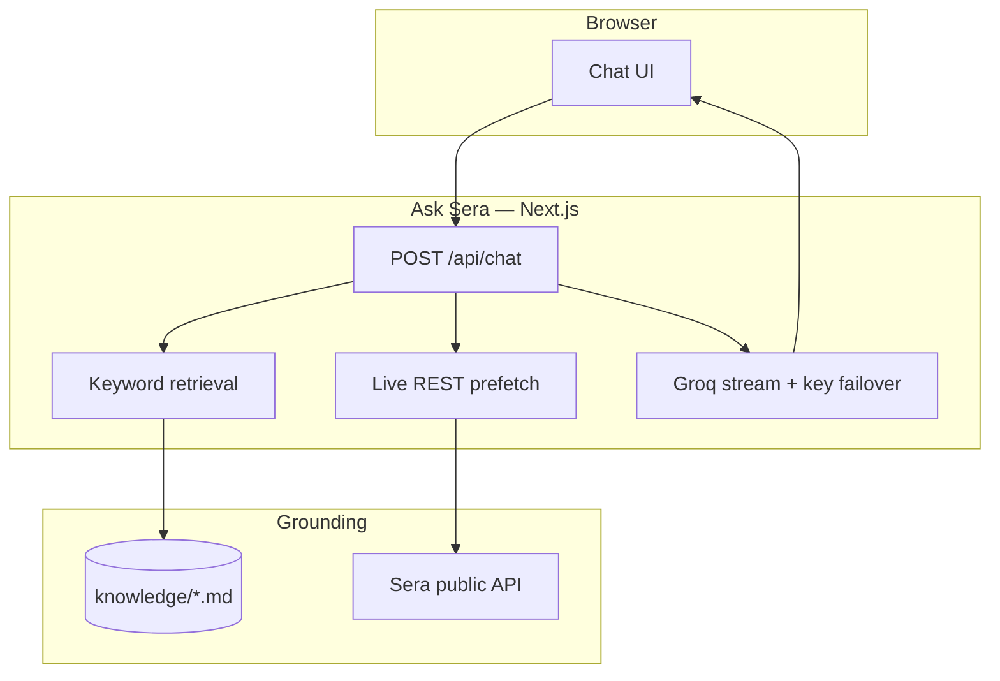

# Ask Sera

**Grounded Q&A for Sera Protocol** — products, APIs, contracts, agents, and live public market data, answered from a curated knowledge pack plus optional live REST.

Community project. Not an official Sera product. Explains only — does not trade, sign, or place orders.

[Live demo](https://ask-sera.vercel.app) · [Sera docs](https://docs.sera.cx) · [sera-mcp](https://github.com/sera-cx/sera-mcp) · [agents.sera.cx](https://agents.sera.cx)

---

## Table of contents

- [Overview](#overview)
- [Architecture](#architecture)
- [Repository](#repository)
- [Quick start](#quick-start)
- [Configuration](#configuration)
- [Knowledge pack](#knowledge-pack)
- [Deploy](#deploy)
- [Related](#related)
- [Contributing](#contributing)
- [License](#license)

---

## Overview

Builders and curious users ask about Sera in plain language. Ask Sera retrieves the right markdown sections, optionally prefetches public Sera REST data, then streams an answer through Groq.

- **Grounded** — answers come from `knowledge/*.md`, not an open web crawl.
- **Live catalogs** — tokens, markets, FX reference rates, health, and config via public REST when the question needs them.
- **Failover** — multiple Groq API keys; on rate limit the next key is tried automatically.
- **Safe errors** — no provider org IDs, quotas, or billing links in the UI.
- **Not a trading bot** — for quotes and settlement use [`sera-mcp`](https://github.com/sera-cx/sera-mcp) or [agents.sera.cx](https://agents.sera.cx).

---

## Architecture



| Layer | Role |
| ----- | ---- |
| **UI** (`components/`) | Chat shell — fixed nav/composer, scrolling thread |
| **API** (`app/api/chat`) | Retrieval + live prefetch + streaming completion |
| **Knowledge** (`knowledge/`) | Curated markdown corpus (chunks on `##`) |
| **Lib** (`lib/`) | Retrieval, live context, Groq failover, prompts, sanitized errors |

---

## Repository

```text
ask-sera/
├── app/                 # Next.js App Router (UI + /api/chat, /api/health)
├── components/          # Chat UI
├── knowledge/           # Answer corpus — best place to contribute
├── lib/                 # Retrieval, live prefetch, LLM, prompts
├── public/              # Static assets
├── .github/             # Issue & PR templates
├── CONTRIBUTING.md
├── SECURITY.md
├── LICENSE
├── package.json
└── README.md
```

Knowledge file map: [knowledge/README.md](./knowledge/README.md).

---

## Quick start

**Prerequisites:** Node 18.17+, [pnpm](https://pnpm.io) 10+, and a [Groq API key](https://console.groq.com/keys).

```bash
git clone https://github.com/Caerlower/ask-sera.git
cd ask-sera
cp .env.example .env.local
# set GROQ_API_KEYS=gsk_…

pnpm install
pnpm dev                  # → http://localhost:3000
```

```bash
pnpm build && pnpm start  # production locally
```

---

## Configuration

**Env template:** [`.env.example`](./.env.example) — copy to `.env.local`.

| Variable | Required | Description |
| -------- | -------- | ----------- |
| `GROQ_API_KEYS` | Yes* | Comma-separated Groq keys. On rate limit, the next key is tried. |
| `GROQ_API_KEY` / `_2` / `_3` | Alt | Numbered keys instead of a list |
| `GROQ_MODEL` | No | Default `llama-3.3-70b-versatile` |
| `SERA_NETWORK` | No | `mainnet` (default) or `sepolia` |
| `SERA_API_BASE` | No | Override Sera REST base URL |

\* One key is enough. Two or three (different Groq orgs) keep the chat up when a daily quota is hit.

Never commit `.env` / `.env.local`.

---

## Knowledge pack

Ask Sera does **not** crawl the web. Edit markdown under `knowledge/`, restart `pnpm dev`, and re-test the question.

| File | Topic |
| ---- | ----- |
| `assistant-policy.md` | Answer quality (always loaded) |
| `overview.md` | What Sera is, status, founder |
| `products.md` | Earn, Pay, On Par, gSera, roadmap |
| `api.md` | REST auth, signing, errors |
| `liquidity.md` | FX vs quote, `no_liquidity` |
| `agents.md` | MCP, agents, live prefetch |
| `contracts.md` | Networks, addresses, v1/v2 |
| `community.md` | Community hub, Token2049 12 seats, gSera vs XP |

Chunks split on `##` headings. Prefer updating an existing file over adding a new one. Don’t invent APYs, TVL, ETAs, or addresses — prefer live `GET /config` / public REST.

---

## Deploy

Live: [https://ask-sera.vercel.app](https://ask-sera.vercel.app)

1. Import this repo into [Vercel](https://vercel.com/).
2. Set `GROQ_API_KEYS` (and optional vars above).
3. Deploy.

---

## Related

| Project | Role |
| ------- | ---- |
| [sera-mcp](https://github.com/sera-cx/sera-mcp) | Official MCP server (~50+ tools) |
| [sera-agents](https://github.com/sera-cx/sera-agents) | Agent templates + CLI |
| [docs.sera.cx](https://docs.sera.cx) | Product docs |
| [docs.testnet.sera.cx](https://docs.testnet.sera.cx) | Developer / REST docs |
| [sera.cx](https://sera.cx/) | Product |
| [agents.sera.cx](https://agents.sera.cx/) | Agents / MCP gateway |

---

## Contributing

See [CONTRIBUTING.md](./CONTRIBUTING.md). Knowledge fixes are the highest-impact PRs.

Before opening a PR that touches `app/` or `lib/`:

```bash
pnpm typecheck
pnpm build
```

Keep secrets out of commits (only `.env.example` is tracked).

---

## License

[MIT](./LICENSE). Sera Protocol and related marks belong to their owners.
