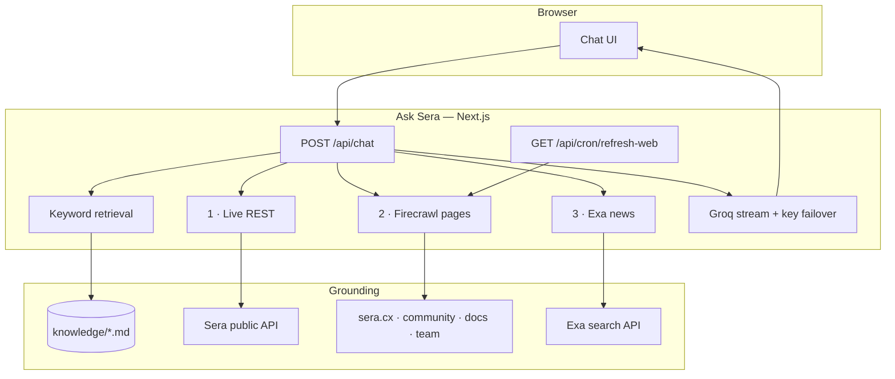

# Ask Sera

**Grounded Q&A for Sera Protocol** — products, APIs, contracts, agents, and live public market data. Static rules stay in curated knowledge; market/on-chain catalogs, official pages, and breaking news stay live (REST + Firecrawl + Exa).

Community project. Not an official Sera product. Explains only — does not trade, sign, or place orders.

[Live demo](https://ask-sera.vercel.app) · [Sera docs](https://docs.sera.cx) · [sera-mcp](https://github.com/sera-cx/sera-mcp) · [agents.sera.cx](https://agents.sera.cx)

---

## Table of contents

- [Overview](#overview)
- [Architecture](#architecture)
- [Repository](#repository)
- [Quick start](#quick-start)
- [Configuration](#configuration)
- [Knowledge pack](#knowledge-pack)
- [Deploy](#deploy)
- [Related](#related)
- [Contributing](#contributing)
- [License](#license)

---

## Overview

Builders and curious users ask about Sera in plain language. Ask Sera retrieves curated markdown, then **prefetches** three live layers in parallel (server-side — more reliable than Groq tool-calling), and streams an answer through Groq.

- **Live catalogs** — tokens, markets, FX, health, config via public REST (never stored in a vector DB)
- **Self-updating pages** — Firecrawl allowlist + TTL cache + weekly cron warm
- **Breaking news** — Exa search scoped to official Sera domains (on-demand). Tweets come from Firecrawl on x.com/seraprotocol.
- **Grounded rules** — curated `knowledge/*.md` for signing footguns and stable policy
- **Failover** — multiple Groq API keys; on rate limit the next key is tried automatically
- **Not a trading bot** — for quotes and settlement use [`sera-mcp`](https://github.com/sera-cx/sera-mcp) or [agents.sera.cx](https://agents.sera.cx)

---

## Architecture

Static project rules stay in markdown. Dynamic market, docs, and news stay live — never dumped into a vector DB for second-by-second stats.

| Information type | Tool | Update frequency | Why |
| ---------------- | ---- | ---------------- | --- |
| Pool / catalogs / FX / health | Sera public REST (`lib/live-context.ts`) | Real-time (per question) | Fetched at ask-time; not stored as embeddings |
| Official docs & product pages | Firecrawl + TTL + weekly cron | Hours + Sunday warm | Allowlisted scrapes overwrite cache |
| Breaking news / announcements | Exa (`lib/exa.ts`) | On-demand | Official Sera domains (not X — tweets via Firecrawl) |
| Signing rules & policy | `knowledge/*.md` | Manual / PR | Stable integrator footguns |



| Layer | Role |
| ----- | ---- |
| **UI** (`components/`) | Chat shell — fixed nav/composer, scrolling thread |
| **API** (`app/api/chat`) | Retrieval + 3 live prefetches + streaming completion |
| **Cron** (`app/api/cron/refresh-web`) | Weekly Firecrawl warm of the allowlist |
| **Knowledge** (`knowledge/`) | Curated corpus (signing footguns, stable facts) |
| **Live REST** (`lib/live-context.ts`) | Real-time catalogs / FX / health / config |
| **Live web** (`lib/live-web.ts`) | Allowlisted Firecrawl scrapes (Next data cache) |
| **Live news** (`lib/exa.ts`) | Exa for announcement-style questions |

---

## Repository

```text
ask-sera/
├── app/                 # Next.js App Router (UI + /api/chat, cron, health)
├── components/          # Chat UI
├── knowledge/           # Answer corpus — best place to contribute
├── lib/                 # Retrieval, REST / Firecrawl / Exa, LLM, prompts
├── public/              # Static assets
├── vercel.json          # Weekly Firecrawl warm cron
├── .github/             # Issue & PR templates
├── CONTRIBUTING.md
├── SECURITY.md
├── LICENSE
├── package.json
└── README.md
```

Knowledge file map: [knowledge/README.md](./knowledge/README.md).

---

## Quick start

**Prerequisites:** Node 18.17+, [pnpm](https://pnpm.io) 10+, and a [Groq API key](https://console.groq.com/keys).

```bash
git clone https://github.com/Caerlower/ask-sera.git
cd ask-sera
cp .env.example .env.local
# set GROQ_API_KEYS=gsk_…

pnpm install
pnpm dev                  # → http://localhost:3000
```

```bash
pnpm build && pnpm start  # production locally
```

---

## Configuration

**Env template:** [`.env.example`](./.env.example) — copy to `.env.local`.

| Variable | Required | Description |
| -------- | -------- | ----------- |
| `GROQ_API_KEYS` | Yes | Comma-separated Groq keys. On rate limit, the next key is tried. |
| `GROQ_API_KEY` / `_2` / `_3` | Alt | Numbered keys instead of a list |
| `GROQ_MODEL` | No | Default `openai/gpt-oss-120b` (Groq replacement for decommissioned `llama-3.3-70b-versatile`; alt: `qwen/qwen3.6-27b`) |
| `SERA_NETWORK` | No | `mainnet` (default) or `sepolia` |
| `SERA_API_BASE` | No | Override REST base for the *default* network only (`SERA_NETWORK`). Cross-network `/config` still uses built-in bases unless `SERA_API_BASE_SEPOLIA` / `SERA_API_BASE_MAINNET` are set. |
| `FIRECRAWL_API_KEY` | No | Layer 2 — allowlisted official page scrapes |
| `FIRECRAWL_CACHE_TTL_HOURS` | No | Page cache TTL (default `6`) |
| `CRON_SECRET` | Cond. | Required when Firecrawl is set — auth for weekly warm cron |
| `EXA_API_KEY` | No | Layer 3 — recent announcements search |
| `EXA_RECENCY_DAYS` | No | How far back Exa looks (default `14`) |

When `FIRECRAWL_API_KEY` is set, also set `CRON_SECRET` (Vercel Cron sends `Authorization: Bearer <CRON_SECRET>`).

Set `FIRECRAWL_API_KEY` + `EXA_API_KEY` + `CRON_SECRET` on Vercel for the full live stack. Without them, Ask Sera still works on curated knowledge + public REST.

Never commit `.env` / `.env.local`.

---

## Knowledge pack

Ask Sera does **not** open-crawl the web. It uses:

1. **Live REST** — catalogs, FX, health, config (per question)  
2. **Firecrawl (optional)** — allowlisted official pages + TTL + weekly cron  
3. **Exa (optional)** — recent announcements on official Sera domains (tweets use Firecrawl)  
4. **`knowledge/*.md`** — curated facts (especially API signing footguns)

Edit markdown under `knowledge/` for durable integrator notes. Product/community copy on official sites updates via Firecrawl without a hand edit — as long as `FIRECRAWL_API_KEY` is set.

| File | Topic |
| ---- | ----- |
| `assistant-policy.md` | Answer quality (always loaded) |
| `overview.md` | What Sera is, status, team |
| `products.md` | Earn, Pay, On Par, gSera, roadmap |
| `api.md` | REST auth, signing, errors |
| `liquidity.md` | FX vs quote, `no_liquidity` |
| `agents.md` | MCP, agents, live prefetch |
| `contracts.md` | Networks, addresses, v1/v2 |
| `community.md` | Community hub, Token2049 12 seats, gSera vs XP |

Chunks split on `##` headings. Prefer updating an existing file over adding a new one. Don’t invent APYs, TVL, ETAs, or addresses — prefer live `GET /config` / public REST.

---

## Deploy

Live: [https://ask-sera.vercel.app](https://ask-sera.vercel.app)

1. Import this repo into [Vercel](https://vercel.com/).
2. Set `GROQ_API_KEYS`, plus optional `FIRECRAWL_API_KEY`, `EXA_API_KEY`, `CRON_SECRET`, Sera vars.
3. Deploy — `vercel.json` registers a Sunday 06:00 UTC cron to warm Firecrawl.

---

## Related

| Project | Role |
| ------- | ---- |
| [sera-mcp](https://github.com/sera-cx/sera-mcp) | Official MCP server (~50+ tools) |
| [sera-agents](https://github.com/sera-cx/sera-agents) | Agent templates + CLI |
| [docs.sera.cx](https://docs.sera.cx) | Product docs |
| [docs.testnet.sera.cx](https://docs.testnet.sera.cx) | Developer / REST docs |
| [sera.cx](https://sera.cx/) | Product |
| [agents.sera.cx](https://agents.sera.cx/) | Agents / MCP gateway |

---

## Contributing

See [CONTRIBUTING.md](./CONTRIBUTING.md). Knowledge fixes are the highest-impact PRs.

Before opening a PR that touches `app/` or `lib/`:

```bash
pnpm typecheck
pnpm build
```

Keep secrets out of commits (only `.env.example` is tracked).

---

## License

[MIT](./LICENSE). Sera Protocol and related marks belong to their owners.
